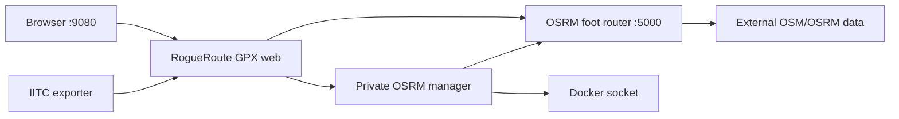

<div align="center">


# RogueRoute GPX

**Turn portal lists and coordinates into practical, path-following GPX routes.**

[](https://github.com/RogueAssassin/RogueRoute-GPX/releases)
[](https://github.com/RogueAssassin/RogueRoute-GPX/pkgs/container/rogueroute-gpx)
[](#install-from-scratch)
[](#requirements)

Version **12.5.0** · Standalone Docker Compose deployment · Local OSRM routing

</div>

RogueRoute GPX accepts IITC exports, JSON, CSV and coordinate lists, routes them along OpenStreetMap roads and walking tracks, and exports GPX files that are detailed enough to follow without overwhelming GPX applications. The production server pulls a prebuilt GHCR image—there is no Node.js, TypeScript or pnpm build on the host.

## Why RogueRoute GPX?

| | What you get |
| --- | --- |
| 🥾 | **Follow the real path** — local OSRM routing uses mapped roads, footways and walking tracks instead of drawing straight lines. |
| 🧲 | **Recover difficult portals** — strict routing progressively searches from 250 m up to the configurable 5,000 m snap limit. |
| 🗺️ | **See the route before export** — the interactive map shows the route, original waypoints, automatic snap corrections and failures. |
| 📍 | **Keep important geometry** — adaptive simplification retains endpoints, leg boundaries and meaningful bends. |
| 📦 | **Produce manageable GPX files** — Automatic mode targets 1,000 track points by default, with Compact and Full alternatives. |
| 🌏 | **Manage regional maps** — resumable Geofabrik downloads and Docker-based OSRM preparation are included. |
| 🐳 | **Keep the server light** — the application runs from GHCR and OSRM runs in its own container. |
| 🔄 | **Switch from the website** — an authenticated internal manager validates the graph and recreates only OSRM. |
| 🧱 | **Stay independent** — RogueRoute uses its own Docker network and is not part of Rogue Dashboard or another media stack. |

## Install from scratch

### Requirements

- 64-bit AMD64 or ARM64 Linux
- Docker Engine and Docker Compose v2 (`docker compose`)
- Git, Bash, curl and OpenSSL
- Port `9080` for the web interface
- A dedicated folder for downloaded `.osm.pbf` and prepared `.osrm*` files

### 1. Clone directly into the permanent installation folder

```bash
sudo install -d -o "$USER" -g "$(id -gn)" /opt/media-server/RogueRoute-GPX
git clone https://github.com/RogueAssassin/RogueRoute-GPX.git /opt/media-server/RogueRoute-GPX
cd /opt/media-server/RogueRoute-GPX
```

### 2. Install the standalone runtime

```bash
sudo ./install.sh \
  --data-dir /mnt/h/osrm \
  --region new-zealand
```

The installation remains a Git checkout. The installer creates the ignored
machine-local `.env`, preserves the external OSRM data folder, generates a
persistent encryption key and pins the container to the repository's
`VERSION`.

### 3. Prepare the first map region

Skip the download and preparation commands when a complete graph already exists in `/mnt/h/osrm`.

```bash
cd /opt/media-server/RogueRoute-GPX
./rogueroute osm list
./rogueroute osm download new-zealand
./rogueroute osm prepare new-zealand
./rogueroute start
```

### 4. Open RogueRoute

Visit `http://SERVER-IP:9080` and generate a known route. Change `HOST_PORT` in `.env` if port 9080 is already in use.

## What Docker starts



| Container | Purpose | Persistent dependency |
| --- | --- | --- |
| `rogueroute-gpx-web` | Interface, input parsing, route generation, preview and GPX export | `.env` |
| `rogueroute-gpx-manager` | Authenticated internal region switching and OSRM-only recreation | Private secret volume, `.env`, read-only map data and Docker socket |
| `rogueroute-gpx-osrm` | Local MLD routing using the foot profile | `OSRM_DATA_DIR` |

The manager has no published port and requires the generated private token file for every management request. Only the manager mounts the Docker socket; the public web container never receives it.

## Day-to-day commands

```bash
# Start the pinned containers
./rogueroute start

# Update the repository, synchronize VERSION and apply the matching image
git pull --ff-only
./rogueroute update

# One-time ownership repair, only if an update reports a permissions error
sudo ./rogueroute permissions

# View status and follow logs
./rogueroute status
./rogueroute logs
./rogueroute doctor
./rogueroute config

# Restart or stop without removing map data
./rogueroute restart
./rogueroute stop

# Select another prepared region
./rogueroute osm switch australia
```

## Configuration

Machine-specific settings live in `/opt/media-server/RogueRoute-GPX/.env` and must not be committed.

```dotenv
ROGUEROUTE_VERSION=12.5.0
HOST_PORT=9080

OSRM_DATA_DIR=/mnt/h/osrm
OSRM_ACTIVE_REGION=new-zealand
OSRM_GRAPH=new-zealand-latest.osrm
OSRM_SNAP_RADIUS_METERS=250
OSRM_SNAP_MAX_RADIUS_METERS=5000
OSRM_SWITCH_ENABLED=true
OSRM_MANAGER_URL=http://manager:9090

GPX_MAX_TRACK_POINTS=1000
GPX_SIMPLIFY_TOLERANCE_METERS=2.5
```

Docker generates the manager token inside the private
`rogueroute-gpx-manager-secrets` volume. It is mounted read-only into the web
and manager containers and never enters `.env`, HTML, browser storage, logs or
Nginx Proxy Manager. Public users do not need a key. A global switch lock and
60-second cooldown prevent overlapping or rapid OSRM restarts.

Use `ROGUEROUTE_VERSION=12.5.0` for a reproducible deployment. The matching image is `ghcr.io/rogueassassin/rogueroute-gpx:12.5.0`.

## GPX detail modes

| Mode | Behaviour | Best for |
| --- | --- | --- |
| **Automatic** | Cleans duplicates and raises simplification tolerance only when needed to meet the configured point budget | Normal use |
| **Compact** | Uses stronger simplification for a smaller GPX file | Older or limited GPX applications |
| **Full** | Keeps the OSRM geometry apart from invalid and adjacent duplicate points | Inspection and archival use |

Automatic simplification does not remove submitted waypoints or routed leg boundaries.

## OSM regions

```bash
./rogueroute osm list
./rogueroute osm status
./rogueroute osm path
./rogueroute osm download australia new-zealand japan
./rogueroute osm download-missing --yes
./rogueroute osm prepare new-zealand
./rogueroute osm prepare-downloaded --yes
./rogueroute osm verify new-zealand
./rogueroute osm switch new-zealand
```

`download-missing` processes every catalog entry without a completed PBF,
including resumable partials, while skipping existing downloads. The command
asks for confirmation because the full catalog is very large; `--yes` is for
unattended operation. `prepare-downloaded` builds every downloaded region that
does not yet have a complete MLD graph. Both batch commands continue after an
individual failure and print a final summary.

Downloads retry transient failures and retain `.part` files for a later resume.
Preparation runs `osrm-extract`, `osrm-partition` and `osrm-customize`, then
verifies the required MLD outputs before selecting the graph.

Large regions can require significant RAM, storage and processing time. Prefer country or sub-region extracts over continents and the full planet.

## Upgrade without losing maps

```bash
cd /opt/media-server/RogueRoute-GPX && git pull --ff-only
./rogueroute update
```

`update` reads the tracked `VERSION`, updates only the version field in the
ignored `.env`, pulls that exact GHCR image, and applies the Compose stack.
External map data and existing secrets are untouched. See the upgrading guide
for the one-time conversion from an older copied/ZIP installation.

## Documentation

- [Installation](docs/INSTALL.md)
- [OSM downloads and OSRM preparation](docs/OSM.md)
- [Upgrading and rollback](docs/UPGRADING.md)
- [Troubleshooting](docs/TROUBLESHOOTING.md)
- [Command reference](docs/COMMANDS.md)
- [v12.5.0 release notes](docs/RELEASE-v12.5.0.md)
- [GitHub Desktop release upload](GITHUB-DESKTOP-UPLOAD.md)

## Development and local builds

Production servers pull the prebuilt image. Repository contributors can validate the source with the pinned toolchain:

```bash
corepack enable
corepack prepare pnpm@11.12.0 --activate
pnpm install --frozen-lockfile
pnpm typecheck
pnpm test
pnpm build
```

The supported development runtime is Node.js `24.18.0`. Publishing the GitHub Release tagged `v12.5.0` validates the workspace and builds AMD64 and ARM64 GHCR images.

## Acknowledgements

Routing data is provided by [OpenStreetMap contributors](https://www.openstreetmap.org/copyright), regional extracts by [Geofabrik](https://download.geofabrik.de/), and local route calculation by [OSRM](https://project-osrm.org/).
